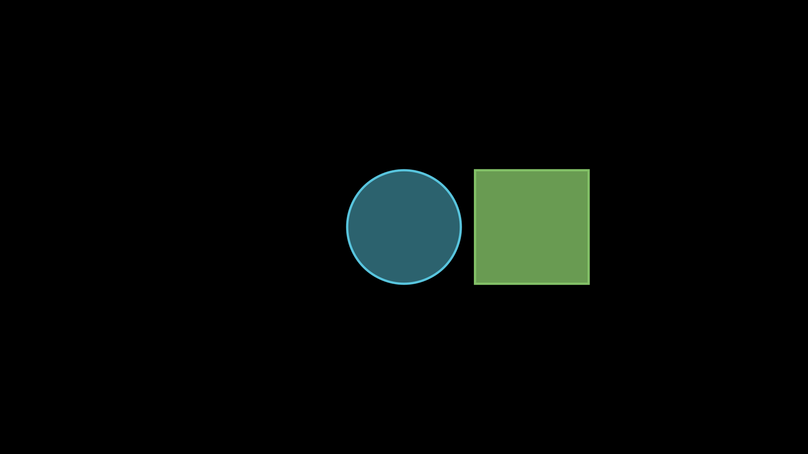

## 01 - Introduction to Manim

Have you ever wondered how *3Blue1Brown* creates amazing mathematical animations in his videos? The answer is **Manim**. *Manim* is an animation tool created by Grant Sanderson, Stanford Graduate and creator of YouTube channel *3Blue1Brown*. 

When Manim was created, it had five major parts. 
1. **Python**: It is the heart of Manim because the library is written in Python. 
2. **LaTeX**: This is the program Manim uses to write text and formulae.
3. **Cairo**: This is the program that makes the diagrams and figures. 
4. **FFmpeg**: This program burns the frames together and forms the video.
5. **SoX**: The audio program which handles the sound in the video.

With time, Grant Sanderson replaced Cairo & SoX with **OpenGL**, a better and faster graphics library. Of all these parts, we just need to write code in Python to make animation videos. 

One thing which you should know about Manim is that - _it has multiple versions!_ 

Manim was originally created by Grant Sanderson as a personal project and for use in his YouTube channel, 3Blue1Brown. As his channel gained popularity, many grew to like the style of his animations and wanted to use manim for their own projects. However, as manim was only intended for personal use, it was very difficult for other users to install and use it. 

In late 2019, Grant started working on faster OpenGL rendering in a new branch, known as the shaders branch. In mid-2020, a group of developers forked it into what is now the community edition; this is the version documented on this website. In early 2021, Grant merged the shaders branch back into master, making it the default branch in his repository – and this is what manimgl is. The old version, before merging the shaders branch is sometimes referred to as ManimCairo and is, at this point, only useful for one singular purpose: rendering Grant’s old videos locally on your machine. It is still available in his GitHub repository in form of the cairo-backend branch.

To summarize: 
* **Manim, or ManimCE** refers to the community maintained version of the library. This is the version documented on this website; the package name on PyPI is manim.
* **ManimGL** is the latest released version of the version of the library developed by Grant “3b1b” Sanderson. It has more experimental features and breaking changes between versions are not documented. Check out its documentation here; on PyPI the package name is manimgl.
* **ManimCairo** is the name that is sometimes used for the old, pre-OpenGL version of manimgl. The latest version of it is available on PyPI as manimlib, but note that if you intend to use it to compile some old project of Grant, you will likely have to install the exact version from the time the project was created from source.


But these different versions leads us to a very obvious question - *Which version should I use?* 

We recommend the community maintained version especially for beginners. It has been developed to be more stable, better tested and documented (!), and quicker to respond to community contributions. It is also perfectly reasonable to start learning with the community maintained version and then switch to a different version later on.

If you do not care so much about documentation or stability, and would like to use the exact same version that Grant is using, then use ManimGL.

***

### 01.1 - Installing Manim

#### Windows 

**Step 1:** Install Python

Manim needs Python 3.7 or a more advanced version. Head over to https://www.python.org, download an installer for Python, and follow its instructions to get Python installed on your system. 

**Step 2:** Install FFmpeg

In order to install FFmpeg on windows, download pre-compiled & ready-to-use version from one of the resources linked at https://ffmpeg.org/download.html#build-windows. 

After downloading the pre-compiled archive, unzip it and, if you like, move the extracted directory to some more permanent place (e.g., C:\Program Files\). Next, edit the PATH environment variable: first, visit Control Panel > System > System settings > Environment Variables, then add the full path to the bin directory inside of the (moved) ffmpeg directory to the PATH variable. Finally, save your changes and exit.

If you now open a new command line prompt (or PowerShell) and run ffmpeg, the command should be recognized.

**Step 3:** Install a LaTeX Distribution

There are two famous distributions of LaTeX - MiKTeX and TeX Live. Installing anyone will suffice the requirements. 

https://miktex.org/download 
https://tug.org/texlive/windows.html 

We recommend MiKTeX for Manim Community Version & TeX Live for ManimGL Version.

> **Caution**: LaTeX packages are generally huge and can take more than 3 or 4 GB of disk space. So, make sure you have sufficient space and strong internet connection.


**Step 4:** Install Manim

At this point, you have all the required dependencies and can now install Manim. To install Manim & use it, use the following command. 

*ManimCE*: `pip3 install manim`
*ManimGL*: `pip3 install manimgl`

#### MacOS

In MacOS, Python 3 comes pre-installed. You can check that by running the following command in terminal. 

```Py
python3 --version
# Output on my mac: Python 3.9.6
```

For installing rest of the dependencies, we will use the popular package manager *Homebrew*. If you haven't installed Homebrew already, install it from here - https://brew.sh/.

**Step 1:** Install FFmpeg & Cairo

```sh
brew install py3cairo ffmpeg
```

**Step 2:** Additional Dependencies

If you are running Apple Silicon based machines (devices with M1 chip or similar), you will need to install some additional dependencies. 

```sh
brew install pango scipy
```

**Step 3:** Install a LaTeX Distribution

For macOS, the recommended LaTeX distribution is MacTeX. 

```sh
brew install --cask mactex-no-gui
```

> **Caution**: MacTeX is a full LaTeX distribution and will require more than 4GB of disk space. 

**Step 4:** Install Manim

After all required dependencies are installed, simply run

```sh
pip3 install manim
```

***

### 01.2 - Getting started with Manim

#### _Hello World_ of Manim

The best way to learn Manim is by working with it. So, below is the equivalent _Hello World_ code in Manim. 

```py
# File: 01_Quickstart.py

from manim import *

class FirstExample(Scene):
    def construct(self):
        blue_circle = Circle(color=BLUE, fill_opacity=0.5)
        green_square = Square(color=GREEN, fill_opacity=0.8)
        green_square.next_to(blue_circle, RIGHT)
        self.add(blue_circle, green_square)
```

Let us try to understand this code line-by-line. 

```py
from manim import *
```

In the first line, we import everything from the Manim library. This is the recommended way of using Manim, as a single script often uses multiple names from the Manim namespace. From this library, in the above example, we have used `Scene`, `Circle`, `Square`, `BLUE`, `GREEN` and `RIGHT`.

```py
class FirstExample(Scene):
```

Then, we define a class `FirstExample`. All animations are written within special classes that inherit the class `Scene` provided by the _manim_ library. `Scene` is the canvas of your animation. On this canvas, you draw figures, animate stuff and eventually convert it into a video. 

```py
def construct(self):
```

We get a method `construct`, provided by the `Scene` class, which we override to create various objects and animations on the canvas. It accepts one argument `self` which could be interpreted as the `Scene` itself which you are creating. So, whenever we do something with `self`, it means we want something to happen on the canvas. 

```py
blue_circle = Circle(color=BLUE, fill_opacity=0.5)
green_square = Square(color=GREEN, fill_opacity=0.8)
```

Say, on the canvas, we want to create two shapes - a circle and a square. The functions, `Circle` and `Square`, used to create shapes are called _Manim Objects_ or _Mobjects_. We alter these objects using the properties provided by manim like `color` and `fill_opacity`. By this point, we have created two shapes and stored them in variables, but not yet added them to the canvas. Just instantiating mobjects does not automatically add them to the scene.  

```py
green_square.next_to(blue_circle, RIGHT)
```

This line is about _positioning_. We have created the mobjects, we want to place them on the canvas/scene, but _where and how?_ This line tells that the green-colored square should be placed on right of the blue-colored circle. _But where is then the blue-colored circle going to get placed?_ By default, the center of the mobject coincides with the center of the scene. So, the blue-colored circle is going to get placed in the center and the green-colored square will be placed on right of it. 

```py
self.add(blue_circle, green_square)
```

In this very last line of the code, we finally add the mobjects to the scene. This means, when the scene will be created, these mobjects will be added immediately. We haven't introduced any animation yet. 

*Expected Output:* An image with a blue-colored circle in the center and a green-colored square on its right.

To generate the output, the syntax is `python3 -m manim -p <file_name> <scene_name>`. The `-p` flag is to preview the output once it is generated. We run the following command to generate the output. 

```sh
python3 -m manim -p 01_Quickstart.py FirstExample
```

This produces an image file with the name `FirstExample_ManimCE_v0.17.2.png` in the folder `media/images/01_Quickstart` as shown below. 



> **Summary so far:** <br><br> Following entities are used in a manim script. <br> <ul><li>Scene: It is the canvas on which we draw and animate figures.</li><li>Mobjects: These are manim objects, entities we play with on the canvas. Typically, you can imagine them to be shapes, graphs, text, etc. Whatever appears on the screen is a manim object. For example: Circle, Square, etc.</li><li>Mobjects have properties: We modify our manim objects using the properties provided like color, fill_opacity, etc.</li><li>Global Constants: There are some global constants for colors (BLUE, GREEN, ...), directions (UP, DOWN, RIGHT, ...), etc.</li></ul> We will look at various Mobjects and their properties throughout these tutorials on Manim.

#### Introducing Animations

So far we were able to run a manim script and generate the image as an output. But you must be thinking - _where are the animations?_ To bring animations on the canvas, we need to first go through the three most important methods which we can call on the scene. These methods are:

* `Scene.add()`: This method adds mobjects immediately to the scene. 
* `Scene.wait()`: This method adds a pause. So, if you want to add two mobjects one after another on the canvas after a certain delay, this method is used to bring that delay. This is the part of the video where nothing happens.
* `Scene.play()`: This method plays *animations*. 

In Manim, *animations*, just like mobjects, are special objects which helps in animating the mobjects in the following ways. 

* Add mobjects: `Create`, `FadeIn`, etc.
* Change one mobject into another: `Transform`, etc.
* Emphasize mobjects: `Indicate`, `Circumscribe`, etc.
* Remove mobjects: `Uncreate`, `FadeOut`, etc.

Let us look at the following example to understand *animations* a bit better. 

```py
# File: 01_Quickstart.py

from manim import *

class AnimatedExample(Scene):
    def construct(self):
        blue_circle = Circle(color=BLUE, fill_opacity=0.5)
        green_square = Square(color=GREEN, fill_opacity=0.8)
        green_square.next_to(blue_circle, RIGHT)
        self.play(Create(blue_circle), run_time=3)
        self.play(FadeIn(green_square), run_time=3)
        self.wait(2)
```

Have a look at the last three lines of the code. For the initial three seconds, a blue circle is created in the scene. Then, for the next three seconds, a green square fades in the scene. Then there is a pause of two seconds when nothing happens. So, the expected length of the entire video is eight seconds. 

To look at the result, run the following command.

```sh
python3 -m manim -p 01_Quickstart.py AnimatedExample
```

This time, the video will be generated with the name `AnimatedExample.mp4` and at the path `/media/videos/01_Quickstart/1080p60/`. You will also notice the folder `partial_movie_files` in which there is a partial movie file for each `Scene.play()` and `Scene.wait()` methods. 

**Pro Tip 1:** _What if we want the blue circle to get created and the green square to fade in at the same time in a period of three seconds?_

In that case, instead of having two play methods, we will need to call both the animations in the same play method as shown below. 

```py
... # previous code remains same
    green_square.next_to(blue_circle, RIGHT)
    self.play(Create(blue_circle), FadeIn(green_square), run_time=3)
    self.wait(2)
```

**Pro Tip 2:** _What if, continuing the above example, we want the blue circle to get created in three seconds and the green square to fade in five seconds?_

In that case, we can use the `run_time` property in each animation object separately, rather than using it in the `Scene.play()` method.

```py
... # previous code remains same
    green_square.next_to(blue_circle, RIGHT)
    self.play(Create(blue_circle, run_time=3), FadeIn(green_square, run_time=5))
    self.wait(2)
```

**Congratulations!!** You created your first animation video powered by Manim. 

***

